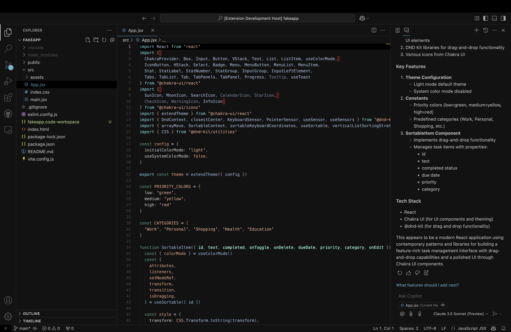
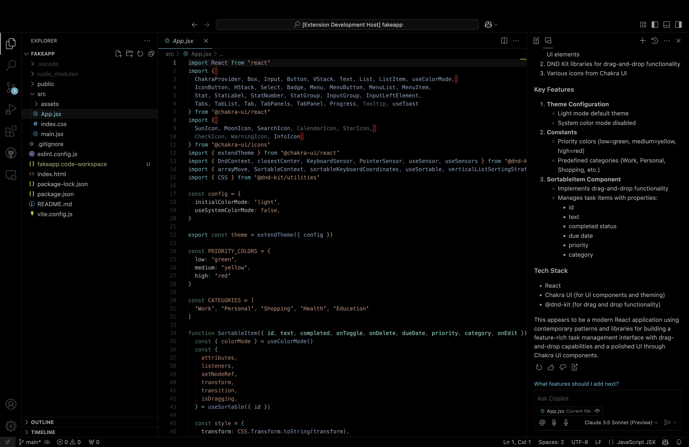

# Miniml Theme

Minimalistic VS Code themes that emphasizes readability with carefully chosen colors and subtle contrasts. Designed for developers who appreciate clean aesthetics without sacrificing functionality.

## Your imput
Open to suggestions and modifications. Let me know if you find any issues!

## Features

- 🎨 Thoughtfully selected color palettes
- 👀 Enhanced readability for long coding sessions
- 🎯 Clear distinction between different code elements
- 🌙 Deep, comfortable background for reduced eye strain
- ✨ Subtle highlighting that doesn't overwhelm
- 📝 Optimized for multiple languages

## Theme Preview

## Installation

1. Open VS Code
2. Go to Extensions (Ctrl+Shift+X / Cmd+Shift+X)
3. Search for "Miniml Theme"
4. Click Install
5. Press Ctrl+K Ctrl+T (Cmd+K Cmd+T on macOS) to open the theme selector
6. Select a theme from the dropdown menu
